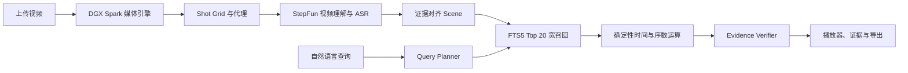

# ShotSeek

> 用一句话，定位长视频里的准确镜头。

ShotSeek 是面向影视后期的证据对齐场景检索工具。它使用 StepFun 理解画面、对白
与查询意图，在 NVIDIA DGX Spark 上建立帧级、镜头级证据时间线，让自然语言查询
返回可验证的时间码、完整镜头边界和证据引用。

## 能做什么

- 使用中文描述对白、人物、动作、物体或地点；StepFun 会把查询规范为英文证据约束，
  再检索英文时间线。
- 理解“之前、之后、期间、第二次、最后一次”等时间约束。
- 将模型的近似时间映射到原片 Shot Grid，而不是直接相信模型时间码。
- 对 Top 20 候选逐项核对画面、对白、反证和边界，再返回 Top 3。
- 为每次搜索保留 Agent Trace、分项得分和直接证据。
- 上传视频后通过 Job、进度事件和断点恢复完成生产流水线。
- 在浏览器工作台中搜索、精确跳转、展开证据并导出剪辑数据。
- 支持 JSON、SRT、XML 和 CMX3600 EDL。

## 技术链路



- **Step 3.7 Flash**：结构化视觉事件、复杂 QuerySpec 和候选证据复核。
- **StepAudio 2.5 ASR**：对白、说话人和毫秒时间戳。
- **FFmpeg / DGX Spark**：媒体探测、镜头切点与帧级时间基。
- **SQLite FTS5**：本地宽召回；时间与序数由确定性代码计算。
- **FastAPI + React**：任务运行时、Range 播放、证据工作台与剪辑导出。

## 已验证能力

| 能力 | 真实验证 |
| --- | --- |
| StepFun 契约 | Files、Step 3.7 视频理解与 StepAudio 2.5 ASR |
| M0 Live 硬门槛 | 通过：真实上传、视觉、ASR、统一时间线与脱敏验收 |
| Production Runtime | Upload、Job、SSE 进度、取消、重试、恢复与内容寻址 |
| 长视频闭环 | 36:58 连续素材处理到 `READY`，216 个 Scene，视觉与 ASR 均为 `LIVE` |
| 工作台 | 播放器、时间轴、结果卡、Evidence Drawer、Agent Trace |
| 交付 | JSON、SRT、XML、CMX3600 EDL |
| 评测 | 黄金回归 40 条 R@1/R@3 100%；独立 Holdout 与 Longform 保留失败结果 |

黄金样片证明回归稳定性，不代表跨素材泛化。当前独立评测没有出现负例误报，但
Holdout v1/v2 与 Longform v1 尚未全部达到 Recall 门槛。完整数字和失败 Case 见
[评测与版本门禁](docs/evaluation.md)。

## 快速开始

需要 Python 3.11+、FFmpeg；仅修改前端时需要 Node.js。

```bash
python3 -m venv .venv
.venv/bin/python -m pip install -e ".[dev,competition]"
cp .env.example .env
```

填写 `.env` 中的 `STEPFUN_API_KEY`，再启动真实 Runtime：

```bash
set -a
. ./.env
set +a
.venv/bin/shotseek-runtime --project-root "$(pwd)" --mode live --host 0.0.0.0
```

打开 `http://127.0.0.1:8000`，上传 MP4 后即可查看阶段进度并搜索。确定性离线演示
可使用 `--mode fixture`，所有模型产物会明确标为 `CACHED`。
若要回放已有分析结果，同时让新中文查询使用 StepFun，可追加
`--allow-network-query`；查询阶段会如实显示 `LIVE` 或 `CACHED`。

启动前可运行只读诊断：

```bash
.venv/bin/shotseek doctor
.venv/bin/shotseek doctor --verbose
.venv/bin/shotseek doctor --json
```

默认 Doctor 完全离线，不读取 `.env` 的值，不启动或终止服务，不修复依赖，也不创建、
删除运行数据。它检查 Python、FFmpeg、Node、浏览器依赖、DGX Spark/NVIDIA 能力、
项目内存储、端口、只读 SQLite、Runtime 健康、StepFun 凭据是否已注入进程，以及现有
前端静态产物。Runtime 未启动时相关检查为 `SKIP`，不会误判为系统失败。

显式扩展检查：

```bash
# 在项目 tmp/ 中做一次 1 秒 NVENC 合成编码，完成后删除临时文件
.venv/bin/shotseek doctor --deep

# 只发送一次低成本 StepFun 文本请求；不上传视频、不启动 ASR
.venv/bin/shotseek doctor --live
```

检查项只使用 `PASS / WARN / FAIL / SKIP`，最终状态为 `pass`、
`pass_with_warnings` 或 `fail`。详细安全边界和可配置阈值见部署指南。

主要接口包括：

```text
GET  /health
POST /api/v1/jobs?filename=episode.mp4
GET  /api/v1/jobs/{job_id}
GET  /api/v1/jobs/{job_id}/events
GET  /api/v1/jobs/{job_id}/result
GET  /api/v1/videos/{video_id}/media
POST /api/v1/videos/{video_id}/search
GET  /api/v1/videos/{video_id}/scenes/{scene_id}/evidence
GET  /api/v1/videos/{video_id}/export?format=edl
```

修改工作台后重新构建：

```bash
cd apps/web
npm ci
npm run typecheck
npm run build
```

详细安装、DGX Spark 检查和运行方式见 [部署指南](docs/deployment.md)，现场流程见
[演示脚本](docs/demo-script.md)。`.env`、媒体、数据库、运行报告和内部文档均被
忽略；密钥只从进程环境读取。

## 验收

```bash
.venv/bin/python -m pytest -q
.venv/bin/python scripts/verify_m0_completion.py
.venv/bin/python scripts/verify_m1_completion.py
.venv/bin/python scripts/run_m2_evaluation.py
.venv/bin/python scripts/verify_m2_completion.py
.venv/bin/python scripts/check_repository_hygiene.py
```

测试素材来自 Blender Foundation 开放电影；来源、区间、SHA-256 和许可信息见
[samples/README.md](samples/README.md)、[Longform v1](docs/materials/longform-v1.md)
与 [Holdout v2](docs/materials/holdout-v2.md)。

## 当前边界

当前版本聚焦单条长视频的“上传 → 搜索 → 证据 → 精确跳转 → 剪辑数据导出”。
它不包含多集管理、自动剪片、视频生成、人脸实名识别或直接控制 DaVinci Resolve。
独立素材的召回泛化仍在继续验证，因此不会把黄金回归结果表述为通用准确率。

## 许可证

ShotSeek 自有代码与文档采用 [Apache License 2.0](LICENSE) 开源。第三方依赖、
模型服务、演示素材以及 NVIDIA、StepFun 标识仍受各自许可证或服务条款约束。
